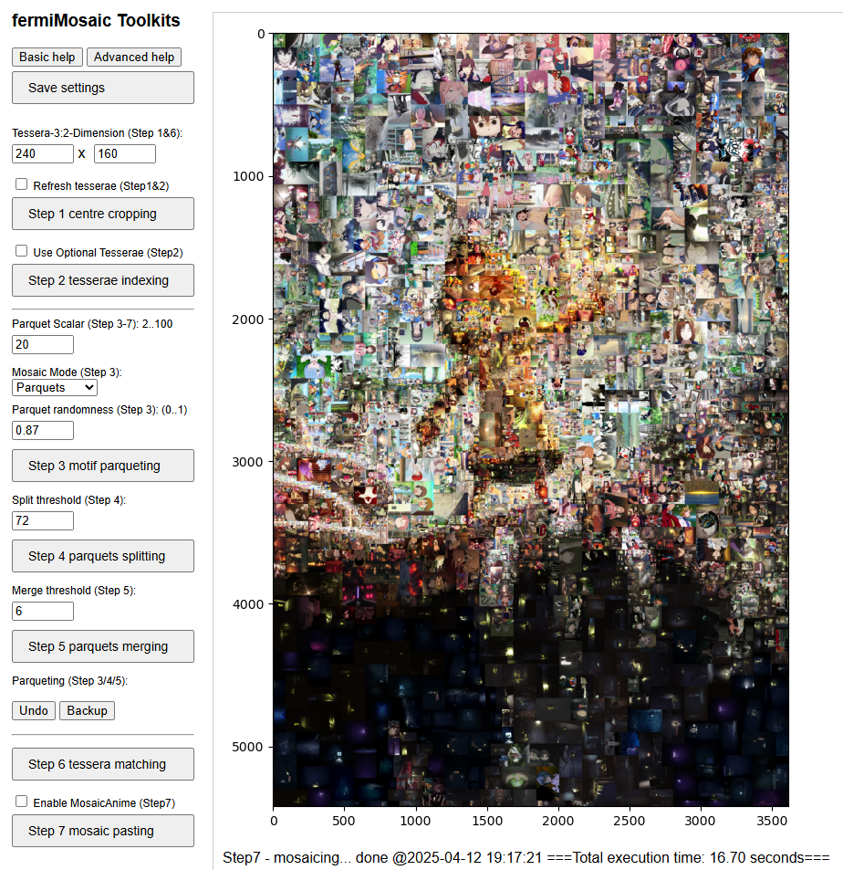

# fermiMosaic-toolkits

FermiMosaic is a streamlined toolkit for generating photo mosaics, which I developed to create my latest piece—a tribute to the anime I watched, the comics I read, and the games I played over the past 50 years.
The project was assisted by free AI models such as ChatGPT, Copilot, DeepSeek, Qwen, and others. FermiMosaic processes a library of tile images to create various mosaic patterns based on a target image. The tool features a user-friendly web interface that guides users through a step-by-step process, with options tailored for both beginners and advanced users..





---

## 📁 Folder Structure

Place all working files in the following structure:

```
~/fermimosaic/
├── app/               # Python 3 code for the web application
├── motif/input.jpg    # Target motif image in JPEG format
├── tiles/             # Directory tree of tile images (JPEG/PNG format)
├── mosaics/           # Output mosaic images (JPEG/GIF format)
├── tesserae/          # tesserae image files of those tiles will be saved here in Step 2
└── index-n-log/       # Generated index files and message logs
```
---

## 🚀 How to Run

1. Open a terminal and launch the app:
   
   cd ~/fermimosaic/app/  
   python app.py

2. Open your browser (preferably Chrome) and navigate to:

   http://127.0.0.1:5000/

---

## 🧩 Web UI Guide

- Click through **Step 1 → Step 7** to complete the mosaic creation process.
- Adjust parameters, save configurations, and run each step interactively.
- Help options available:
  - **Basic Help** – For beginners.
  - **Advanced Help** – For features related to the matching algorithm.

---

## 📦 Output Files

- Mosaic images (.jpg/.gif) will be saved in:
  
  ~/fermimosaic/mosaics/

- Index files and logs will be stored in:
  
  ~/fermimosaic/index-n-log/

---

## ⚙️ Requirements

Make sure Python 3 is installed.

Install dependencies (if a `requirements.txt` is available):

   pip install -r requirements.txt

If you need help generating a `requirements.txt`, let me know!

---
**Note:** Users need to collect their own tile image files (JPEG or PNG format). A few thousand images with diverse colors or patterns are recommended to produce high-quality mosaics.
